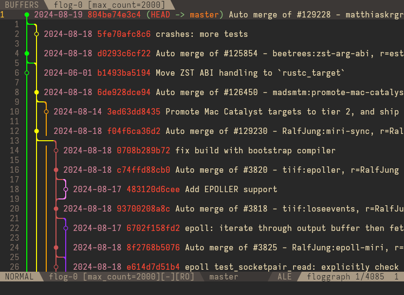

# Flog

[](https://github.com/rbong/vim-flog/actions)

Flog is a blazingly fast, stunningly beautiful, exceptionally powerful Git branch viewer for Vim/Neovim.



## Prerequisites

Neovim is supported natively.

For Vim 8/9, [LuaJIT 2.1](https://luajit.org/download.html) must be installed.
[Lua](https://www.lua.org/) 5.1 is also supported but less performant than LuaJIT.

## Installation

If you use [Plug](https://github.com/junegunn/vim-plug), add the following to your `.vimrc`:

```vim
Plug 'tpope/vim-fugitive'
Plug 'rbong/vim-flog'
```

For lazy.nvim users:

```lua
{
  "rbong/vim-flog",
  lazy = true,
  cmd = { "Flog", "Flogsplit", "Floggit" },
  dependencies = {
    "tpope/vim-fugitive",
  },
},
```

## Features

- Custom log formats
- Collapsible multiline commit messages
- Selected visual range history
- Contextual command completion
- Many navigation mappings
- Commit marks
- Commit jump history
- Intelligent cursor position
- [Fugitive](https://github.com/tpope/vim-fugitive) integration
- Pretty graph characters (currently only in [Kitty](https://github.com/kovidgoyal/kitty))
- Auto updates (Neovim only)
- Dynamic branch highlighting (Neovim only)
- And more!

## Getting Started

- You can open the commit graph with `:Flog` or `:Flogsplit`.
- Use `<Tab>` completion or `:help :Flog` to see available arguments.
- Open commits with [Fugitive](https://github.com/tpope/vim-fugitive) using `<CR>`.
- Jump between commits with `<C-N>` and `<C-P>`.
- Toggle viewing all branches with `a`.
- See more mappings with `g?`.
- Quit with `gq`.

Many familiar mappings from the Fugitive `:Git` status window will work in Flog.

You can also run any git command using `:Floggit`.
This command will contextually complete arguments based on your cursor position.
See `:help :Floggit` for more.

Flog can be heavily customized.
See [examples](EXAMPLES.md) for details.

## More Help

- [FAQ](FAQ.md)
- [Examples](EXAMPLES.md)
- [Issue tracker](https://github.com/rbong/vim-flog/issues)
- [Discussions board](https://github.com/rbong/vim-flog/discussions)
- [Fugitive repo](https://github.com/tpope/vim-fugitive)
- Run `git log --help` in a terminal for help with `git log`.
- Run `:help flog` in Vim to see the full documentation.
